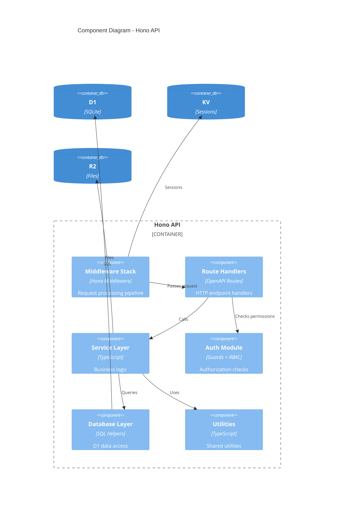
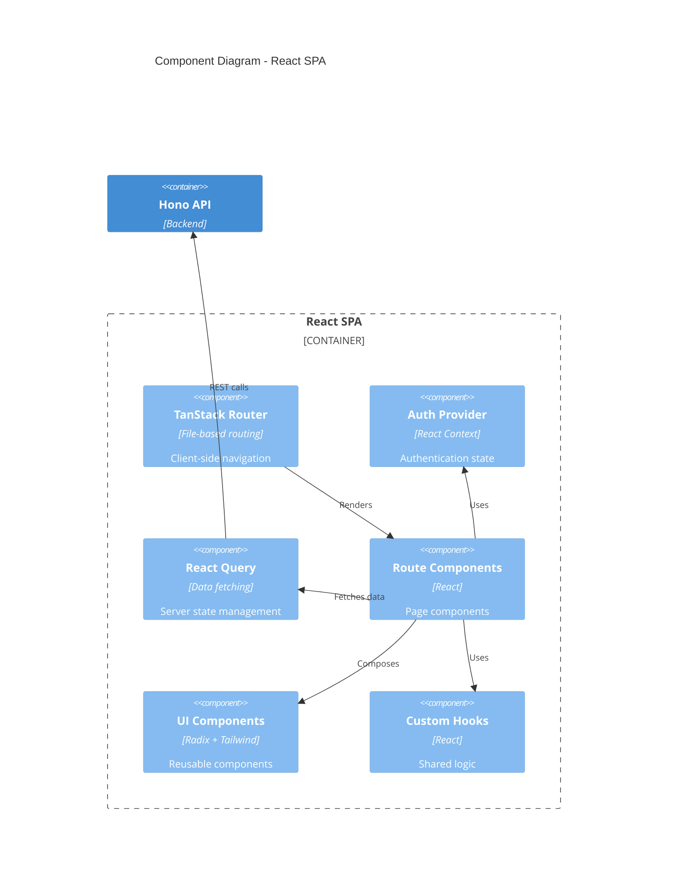

# C4 Model - Level 3: Component Diagrams

> Shows how containers are made up of components and their relationships.

## Backend Components (Hono API)



## Middleware Stack [HIGH]

| Order | Middleware | File | Purpose |
|-------|------------|------|---------|
| 1 | Error Handler | `middleware/error-handler.ts` | Global error handling |
| 2 | Request Context | `middleware/request-context.ts` | Transaction ID, timing |
| 3 | Request Logger | `middleware/request-logger.ts` | Structured logging |
| 4 | CORS | `middleware/cors.ts` | Cross-origin requests |
| 5 | Rate Limiter | `middleware/rate-limit.ts` | Throttling protection |
| 6 | Session Auth | `middleware/auth.ts` | Session validation |
| 7 | Account Context | `middleware/account.ts` | Multi-tenant context |

### Middleware Flow

```
Request
   │
   ▼
┌──────────────────┐
│  Error Handler   │ ◄── Catches all errors
└────────┬─────────┘
         │
         ▼
┌──────────────────┐
│ Request Context  │ ◄── Adds transactionId, startTime
└────────┬─────────┘
         │
         ▼
┌──────────────────┐
│ Request Logger   │ ◄── Logs request details
└────────┬─────────┘
         │
         ▼
┌──────────────────┐
│      CORS        │ ◄── Handles preflight
└────────┬─────────┘
         │
         ▼
┌──────────────────┐
│   Rate Limiter   │ ◄── Throttles excessive requests
└────────┬─────────┘
         │
         ▼
┌──────────────────┐
│   Session Auth   │ ◄── Validates session cookie
└────────┬─────────┘
         │
         ▼
┌──────────────────┐
│ Account Context  │ ◄── Sets current account
└────────┬─────────┘
         │
         ▼
    Route Handler
```

## Route Handlers [HIGH]

| Module | Path | Endpoints | Purpose |
|--------|------|-----------|---------|
| Auth | `/auth/*` | 6 | Authentication flows |
| Users | `/api/users/*` | 8 | User CRUD + bulk |
| Accounts | `/api/accounts/*` | 6 | Account CRUD |
| Invitations | `/api/invitations/*` | 3 | Team invitations |
| Audits | `/api/audits/*` | 1 | Audit log queries |
| Storage | `/api/storage/*` | 3 | File operations |
| Health | `/health/*` | 3 | Health probes |

### Route Structure

```
src/server/routes/
├── index.ts          # API router composition
├── schemas.ts        # Shared schemas
├── openapi.ts        # OpenAPI config
├── api.ts            # API router export
├── auth/
│   ├── index.ts      # Auth router
│   ├── routes.ts     # Route definitions (OpenAPI)
│   ├── handlers.ts   # Request handlers
│   └── schemas.ts    # Auth schemas
├── users/
│   ├── index.ts
│   ├── routes.ts
│   ├── handlers.ts
│   └── schemas.ts
├── accounts/
│   ├── index.ts
│   ├── routes.ts
│   ├── handlers.ts
│   └── schemas.ts
├── invitations/
│   ├── index.ts
│   ├── routes.ts
│   ├── handlers.ts
│   └── schemas.ts
├── audits/
│   ├── index.ts
│   ├── routes.ts
│   ├── handlers.ts
│   └── schemas.ts
├── storage/
│   ├── index.ts
│   ├── routes.ts
│   ├── handlers.ts
│   └── schemas.ts
└── health/
    ├── index.ts
    ├── routes.ts
    └── handlers.ts
```

## Service Layer [HIGH]

| Service | File | Responsibilities |
|---------|------|------------------|
| AuthService | `services/auth.ts` | OAuth flow, session management, token refresh |
| UsersService | `services/users.ts` | User CRUD, account memberships |
| AccountsService | `services/accounts.ts` | Account CRUD, member management |
| InvitationsService | `services/invitations.ts` | Invitation lifecycle |
| AuditsService | `services/audits.ts` | Audit log queries |

### Service Pattern

```typescript
// Each service follows this pattern:
export class UsersService {
  constructor(
    private db: D1Database,
    private context: RequestContext
  ) {}

  async list(accountId: string, pagination: Pagination): Promise<PaginatedUsers> {
    // Business logic + DB queries
  }

  async create(data: CreateUser): Promise<User> {
    // Validation + creation + audit logging
  }
}
```

## Auth Module [HIGH]

| Component | File | Purpose |
|-----------|------|---------|
| Roles | `auth/roles.ts` | Role definitions and hierarchy |
| Permissions | `auth/permissions.ts` | Permission constants |
| Guards | `auth/guards.ts` | Authorization checks |

### Role Hierarchy

```
ADMIN
  └── MANAGER
       └── EDITOR
            └── AUTHOR
                 └── VIEWER

BILLING  (separate branch)
ANALYTICS (separate branch)
```

### Guard Functions

| Guard | Purpose |
|-------|---------|
| `requireAuth()` | Ensures user is authenticated |
| `requireRole(role)` | Checks user has role or higher |
| `requirePermission(perm)` | Checks specific permission |
| `requireSuperAdmin()` | Checks super admin flag |
| `requireAccountMember()` | Verifies account membership |

## Database Layer [HIGH]

| Component | File | Purpose |
|-----------|------|---------|
| SQL Helpers | `db/sql.ts` | `queryOne`, `queryAll`, `execute` |
| Record Types | `db/records.ts` | TypeScript types for SQL results |
| Client | `db/client.ts` | D1 client wrapper |
| Seed | `db/seed.ts` | Test data generator |

### SQL Helper Pattern

```typescript
// Type-safe SQL execution
const user = await queryOne<UserRecord>(db,
  'SELECT * FROM users WHERE id = ?',
  [userId]
);

const users = await queryAll<UserRecord>(db,
  'SELECT * FROM users WHERE account_id = ? LIMIT ? OFFSET ?',
  [accountId, limit, offset]
);

await execute(db,
  'UPDATE users SET name = ? WHERE id = ?',
  [name, userId]
);
```

## Utility Libraries [HIGH]

| Library | File | Purpose |
|---------|------|---------|
| OAuth | `lib/oauth.ts` | Google OAuth helpers |
| Session | `lib/session.ts` | Session create/validate/destroy |
| Tokens | `lib/tokens.ts` | Refresh token management |
| Audit | `lib/audit.ts` | Audit log creation |
| Email | `lib/email.ts` | SendGrid integration |
| Errors | `lib/errors.ts` | Custom error classes |
| Pagination | `lib/pagination.ts` | Pagination helpers |
| R2 Storage | `lib/r2-storage.ts` | File storage helpers |

---

## Frontend Components (React SPA)



## Frontend Route Structure [HIGH]

```
src/client/routes/
├── __root.tsx              # Root layout
├── index.tsx               # Landing page (/)
├── login.tsx               # Login page (/login)
├── $.tsx                   # 404 catch-all
├── invite.$token.tsx       # Invitation acceptance
└── _authenticated/         # Protected routes
    ├── dashboard.tsx       # Dashboard (/dashboard)
    ├── account.tsx         # Account page (/account)
    ├── team.tsx            # Team management (/team)
    ├── settings.tsx        # User settings (/settings)
    └── integrations.tsx    # Integrations (/integrations)
```

## UI Component Library [HIGH]

| Category | Components |
|----------|------------|
| **Layout** | Sidebar |
| **Feedback** | Sonner (Toasts), Loading Skeleton, Error Fallback |
| **Forms** | Input, Label, Form, Button |
| **Display** | Card, Badge, Avatar, Tabs |
| **Overlay** | Dialog |
| **Utility** | Separator, Skeleton |

## Custom Hooks [HIGH]

| Hook | File | Purpose |
|------|------|---------|
| `useAuth` | `hooks/use-auth.ts` | Authentication state + methods |
| `useTheme` | `hooks/use-theme.tsx` | Theme (dark/light) management |
