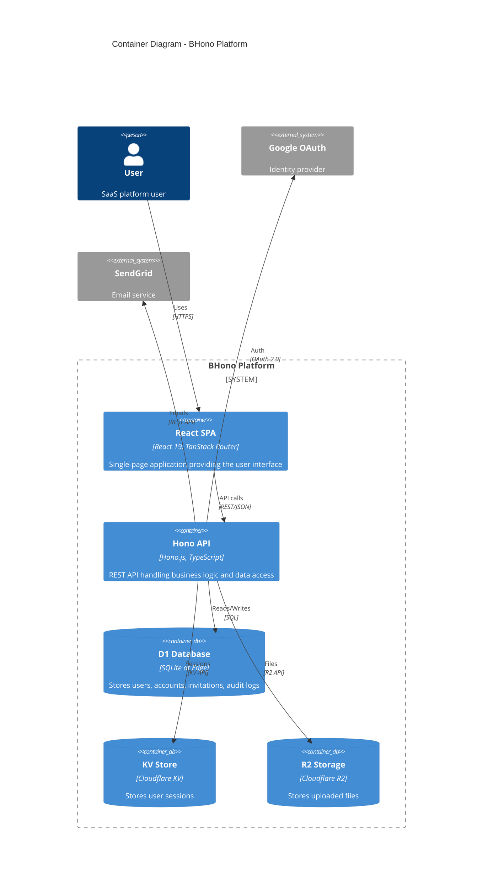

# C4 Model - Level 2: Container Diagram

> Shows the high-level shape of the software architecture and how responsibilities are distributed.

## Container Diagram



## Container Details

### React SPA [HIGH]

| Attribute | Value |
|-----------|-------|
| **Technology** | React 19, TanStack Router, TanStack Query |
| **Deployment** | Static assets served from Cloudflare R2/Edge |
| **Purpose** | User interface for the SaaS platform |
| **Build Output** | `dist/` directory |

**Responsibilities:**
- Render user interface
- Handle client-side routing
- Manage client state
- Call backend API
- Handle authentication redirects

**Key Dependencies:**
- `react` - UI library
- `@tanstack/react-router` - File-based routing
- `@tanstack/react-query` - Data fetching/caching
- `react-hook-form` - Form handling
- `tailwindcss` - Styling
- `radix-ui/*` - Accessible UI primitives

### Hono API [HIGH]

| Attribute | Value |
|-----------|-------|
| **Technology** | Hono.js 4.x, TypeScript, Zod |
| **Deployment** | Cloudflare Workers |
| **Purpose** | REST API for all backend operations |
| **Entry Point** | `src/server/index.ts` |

**Responsibilities:**
- Handle HTTP requests
- Authenticate/authorize users
- Execute business logic
- Access data stores
- Generate OpenAPI documentation

**Key Dependencies:**
- `hono` - Web framework
- `@hono/zod-openapi` - OpenAPI integration
- `zod` - Request/response validation
- `uuidv7` - ID generation

### D1 Database [HIGH]

| Attribute | Value |
|-----------|-------|
| **Technology** | Cloudflare D1 (SQLite) |
| **Binding** | `DB` |
| **Schema** | `schema.sql` |

**Tables:**
| Table | Purpose |
|-------|---------|
| `users` | User profiles and authentication |
| `accounts` | Workspaces/organizations |
| `user_accounts` | User-account memberships with roles |
| `invitations` | Pending team invitations |
| `refresh_tokens` | Token storage for session refresh |
| `audit_logs` | All state change audit trail |

### KV Store [HIGH]

| Attribute | Value |
|-----------|-------|
| **Technology** | Cloudflare KV |
| **Binding** | `SESSIONS` |
| **Purpose** | Session storage |

**Data Stored:**
- Session ID → User session data (JSON)
- Session expiration via TTL

### R2 Storage [HIGH]

| Attribute | Value |
|-----------|-------|
| **Technology** | Cloudflare R2 |
| **Binding** | `R2_BUCKET` |
| **Purpose** | File storage |

**Usage:**
- User-uploaded files
- Account-scoped file storage
- Presigned URL support for secure uploads

## Inter-Container Communication

| From | To | Protocol | Purpose |
|------|-----|----------|---------|
| React SPA | Hono API | REST/JSON | All data operations |
| Hono API | D1 | SQL | Data persistence |
| Hono API | KV | KV API | Session management |
| Hono API | R2 | R2 API | File operations |
| Hono API | Google | OAuth 2.0 | Authentication |
| Hono API | SendGrid | REST | Email delivery |

## Deployment Architecture

```
┌─────────────────────────────────────────────────────────┐
│                 Cloudflare Edge Network                 │
│  ┌──────────────────────────────────────────────────┐   │
│  │              Cloudflare Worker                   │   │
│  │  ┌─────────────────┐  ┌─────────────────────┐    │   │
│  │  │   Static Assets │  │     Hono API        │    │   │
│  │  │   (React SPA)   │  │   (Server Logic)    │    │   │
│  │  └─────────────────┘  └──────────┬──────────┘    │   │
│  └──────────────────────────────────┼───────────────┘   │
│                                     │                   │
│     ┌───────────┬───────────────────┼───────────────┐   │
│     │           │                   │               │   │
│     ▼           ▼                   ▼               │   │
│  ┌─────┐    ┌─────┐            ┌─────────┐          │   │
│  │ D1  │    │ KV  │            │   R2    │          │   │
│  └─────┘    └─────┘            └─────────┘          │   │
└─────────────────────────────────────────────────────────┘
```

## Request Flow

### Authenticated Request

```
1. User → React SPA: Navigate to /dashboard
2. React SPA → Hono API: GET /api/users (with session cookie)
3. Hono API → KV: Validate session
4. Hono API → D1: Query users for account
5. D1 → Hono API: User data
6. Hono API → React SPA: JSON response
7. React SPA → User: Render dashboard
```

### Authentication Flow

```
1. User → React SPA: Click "Login with Google"
2. React SPA → Hono API: GET /auth/login
3. Hono API → User: Redirect to Google OAuth
4. User → Google: Authorize
5. Google → Hono API: GET /auth/callback (with code)
6. Hono API → Google: Exchange code for tokens
7. Hono API → D1: Create/update user
8. Hono API → KV: Create session
9. Hono API → User: Set cookie, redirect to app
```
