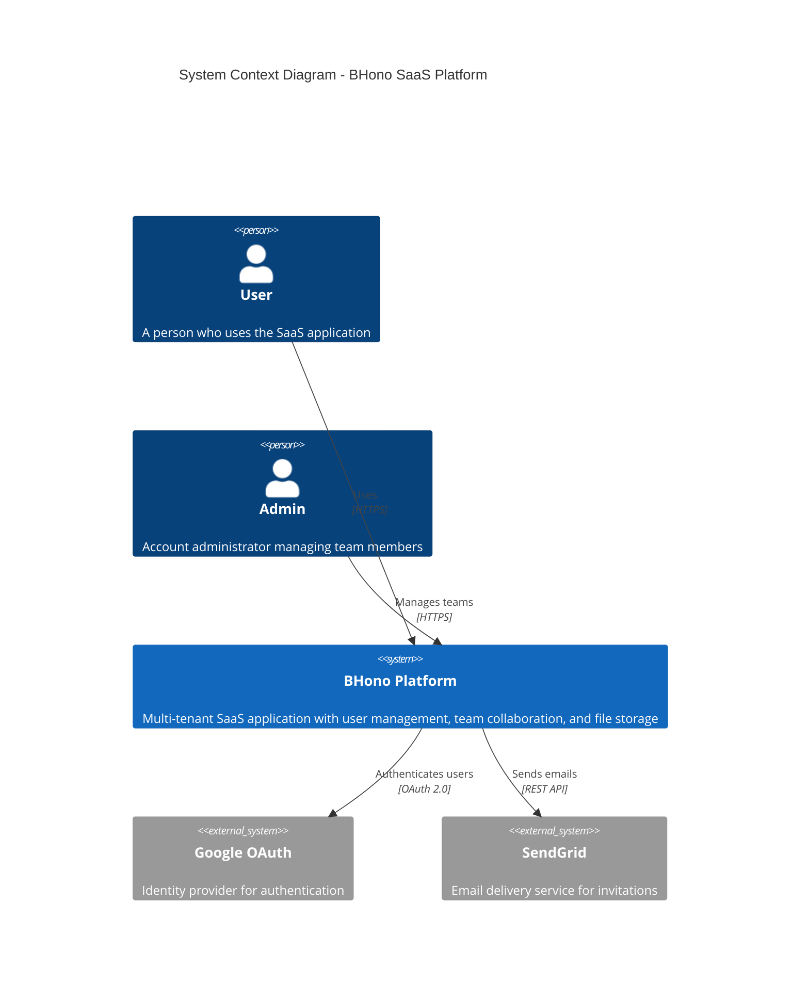

# C4 Model - Level 1: System Context

> Shows how BHono fits into the world around it.

## System Context Diagram



## Context Description

| Element | Type | Description | Confidence |
|---------|------|-------------|------------|
| **User** | Person | End user of the SaaS platform. Can belong to multiple accounts (workspaces). | HIGH |
| **Admin** | Person | Account administrator with elevated permissions to manage team members and invitations. | HIGH |
| **BHono Platform** | System | The main application - a multi-tenant SaaS platform deployed on Cloudflare Workers edge. | HIGH |
| **Google OAuth** | External System | Google's OAuth 2.0 service used for user authentication. | HIGH |
| **SendGrid** | External System | Email delivery service for sending team invitations. | HIGH |

## System Responsibilities

### BHono Platform

The core system provides:

| Capability | Description | Confidence |
|------------|-------------|------------|
| **User Authentication** | OAuth 2.0 flow with Google, session management via cookies | HIGH |
| **Multi-tenancy** | Users can belong to multiple Accounts with different roles | HIGH |
| **Team Collaboration** | Invite team members via email, manage permissions | HIGH |
| **File Storage** | Upload/download files via R2 storage | HIGH |
| **Audit Logging** | Track all state changes for compliance | HIGH |
| **API Access** | REST API with OpenAPI documentation | HIGH |

## External System Dependencies

### Google OAuth [HIGH]

- **Purpose**: User authentication
- **Protocol**: OAuth 2.0 with PKCE
- **Endpoints Used**:
  - `https://accounts.google.com/o/oauth2/v2/auth` - Authorization
  - `https://oauth2.googleapis.com/token` - Token exchange
  - `https://www.googleapis.com/oauth2/v3/userinfo` - User info
- **Data Exchanged**: User email, name, avatar URL, Google ID

### SendGrid [HIGH]

- **Purpose**: Email delivery for invitations
- **Protocol**: REST API
- **Endpoints Used**: SendGrid Mail Send API
- **Data Exchanged**: Recipient email, invitation details, sender info

## User Roles

| Role | Description | Confidence |
|------|-------------|------------|
| **ADMIN** | Full account access, can manage all members and settings | HIGH |
| **MANAGER** | Can manage team members (invite, remove) | HIGH |
| **EDITOR** | Can edit all content | HIGH |
| **AUTHOR** | Can create and edit own content | HIGH |
| **VIEWER** | Read-only access | HIGH |
| **BILLING** | Access to billing information | HIGH |
| **ANALYTICS** | Access to analytics and audit logs | HIGH |

## Non-Functional Requirements

| Requirement | Target | Implementation | Confidence |
|-------------|--------|----------------|------------|
| **Latency** | <100ms globally | Cloudflare Edge deployment | HIGH |
| **Availability** | 99.9%+ | Cloudflare Workers SLA | HIGH |
| **Security** | OAuth 2.0, RBAC | Google OAuth + Guards | HIGH |
| **Compliance** | Audit trail | audit_logs table | HIGH |
| **Multi-region** | Global | Cloudflare Edge network | HIGH |

## Data Flow Overview

```
┌─────────┐     HTTPS      ┌──────────────────┐
│  User   │───────────────▶│  BHono Platform  │
└─────────┘                └────────┬─────────┘
                                    │
                    ┌───────────────┼───────────────┐
                    │               │               │
                    ▼               ▼               ▼
            ┌───────────┐   ┌───────────┐   ┌───────────┐
            │  Google   │   │  SendGrid │   │ Cloudflare│
            │  OAuth    │   │           │   │ Services  │
            └───────────┘   └───────────┘   └───────────┘
                                            D1 | KV | R2
```
