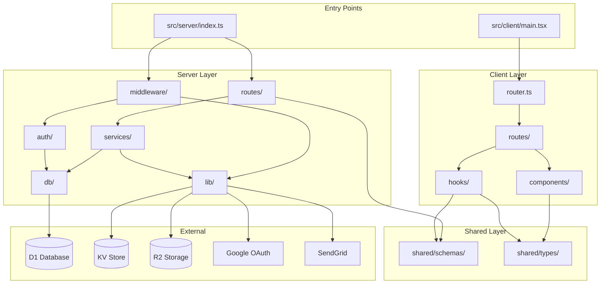
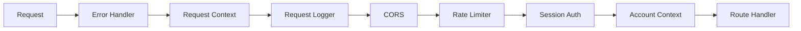
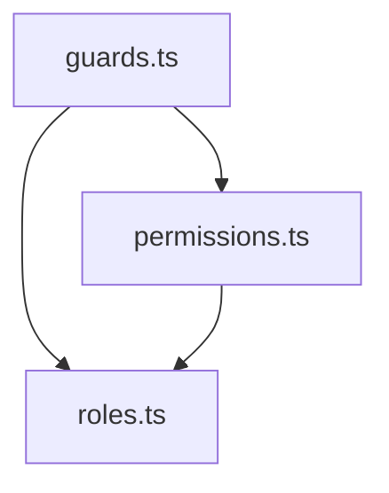

# Module Dependencies - BHono Platform

> Service and module dependency map showing how components interact.

## Dependency Overview



---

## Server Dependencies [HIGH]

### Middleware Layer

| Module | Dependencies | Purpose |
|--------|--------------|---------|
| `error-handler.ts` | `lib/errors` | Global error handling |
| `request-context.ts` | `uuidv7` | Transaction ID generation |
| `request-logger.ts` | `request-context` | Structured logging |
| `cors.ts` | `hono/cors` | CORS configuration |
| `rate-limit.ts` | None | In-memory rate limiting |
| `auth.ts` | `lib/session`, `auth/guards` | Session validation |
| `account.ts` | `db/sql`, `auth/guards` | Account context |



### Routes Layer

| Route Module | Service Dependencies | Schema Dependencies |
|--------------|---------------------|---------------------|
| `auth/` | `AuthService` | `auth/schemas` |
| `users/` | `UsersService` | `users/schemas`, `shared/schemas/user` |
| `accounts/` | `AccountsService` | `accounts/schemas`, `shared/schemas/account` |
| `invitations/` | `InvitationsService` | `invitations/schemas`, `shared/schemas/invitation` |
| `audits/` | `AuditsService` | `audits/schemas` |
| `storage/` | R2 direct | `storage/schemas` |
| `health/` | D1 direct | None |

### Services Layer

| Service | Dependencies | External |
|---------|--------------|----------|
| `AuthService` | `db/sql`, `lib/oauth`, `lib/session`, `lib/tokens` | Google OAuth, KV |
| `UsersService` | `db/sql`, `lib/audit` | D1 |
| `AccountsService` | `db/sql`, `lib/audit` | D1 |
| `InvitationsService` | `db/sql`, `lib/email`, `lib/tokens` | D1, SendGrid |
| `AuditsService` | `db/sql` | D1 |

### Library Layer

| Library | Dependencies | External Services |
|---------|--------------|-------------------|
| `oauth.ts` | None | Google OAuth APIs |
| `session.ts` | None | Cloudflare KV |
| `tokens.ts` | `crypto` | None |
| `email.ts` | None | SendGrid API |
| `audit.ts` | `db/sql` | D1 |
| `pagination.ts` | None | None |
| `errors.ts` | None | None |
| `r2-storage.ts` | None | Cloudflare R2 |

### Auth Layer

| Module | Dependencies | Purpose |
|--------|--------------|---------|
| `roles.ts` | None | Role hierarchy definition |
| `permissions.ts` | `roles` | Permission constants |
| `guards.ts` | `roles`, `permissions` | Authorization checks |



### Database Layer

| Module | Dependencies | Purpose |
|--------|--------------|---------|
| `sql.ts` | D1 binding | Query helpers |
| `records.ts` | None | Type definitions |
| `client.ts` | D1 binding | Client wrapper |
| `seed.ts` | `sql.ts` | Test data generation |

---

## Client Dependencies [HIGH]

### Route Dependencies

| Route | Component Dependencies | Hook Dependencies |
|-------|----------------------|-------------------|
| `__root.tsx` | `Sonner`, `ErrorBoundary` | `useTheme` |
| `_authenticated.tsx` | `Sidebar`, `LoadingSkeleton` | `useAuth` |
| `login.tsx` | `Button`, `Card`, `Icons` | None |
| `dashboard.tsx` | `Card`, `Badge` | `useAuth` |
| `team.tsx` | `Card`, `Dialog`, `Avatar` | `useAuth` |
| `settings.tsx` | `Tabs`, `Form`, `Input` | `useAuth` |
| `account.tsx` | `Card`, `Badge` | `useAuth` |
| `integrations.tsx` | `Card`, `Dialog`, `Badge` | `useAuth` |

### Component Dependencies

| Component | External Dependencies |
|-----------|----------------------|
| `Button` | `class-variance-authority`, `@radix-ui/react-slot` |
| `Dialog` | `@radix-ui/react-dialog` |
| `Tabs` | `@radix-ui/react-tabs` |
| `Avatar` | `@radix-ui/react-avatar` |
| `Form` | `react-hook-form`, `@hookform/resolvers/zod` |
| `Sonner` | `sonner` |
| `Sidebar` | `lucide-react` |

### Hook Dependencies

| Hook | Dependencies |
|------|--------------|
| `useAuth` | `@tanstack/react-query`, `shared/types/auth` |
| `useTheme` | React Context |

---

## Shared Dependencies [HIGH]

### Schemas

| Schema | Used By |
|--------|---------|
| `user.ts` | `server/routes/users`, `client/hooks/use-auth` |
| `account.ts` | `server/routes/accounts`, `client/routes/account` |
| `invitation.ts` | `server/routes/invitations`, `client/routes/team` |
| `profile.ts` | `server/routes/users`, `client/routes/settings` |
| `webhook.ts` | `client/routes/integrations` |

### Types

| Type Module | Used By |
|-------------|---------|
| `auth.ts` | Server auth, client hooks |
| `user.ts` | Server services, client routes |
| `account.ts` | Server services, client routes |
| `api.ts` | Server routes, client API calls |

---

## External Dependencies [HIGH]

### NPM Packages

#### Backend

| Package | Version | Purpose |
|---------|---------|---------|
| `hono` | 4.11.x | Web framework |
| `@hono/zod-openapi` | 1.2.x | OpenAPI integration |
| `@hono/swagger-ui` | 0.5.x | API documentation |
| `zod` | 4.3.x | Schema validation |
| `uuidv7` | 1.1.x | UUID generation |

#### Frontend

| Package | Version | Purpose |
|---------|---------|---------|
| `react` | 19.x | UI library |
| `@tanstack/react-router` | 1.144.x | File-based routing |
| `@tanstack/react-query` | 5.90.x | Data fetching |
| `react-hook-form` | 7.70.x | Form handling |
| `tailwindcss` | 4.1.x | Styling |
| `@radix-ui/*` | 1.x | UI primitives |
| `lucide-react` | 0.562.x | Icons |
| `sonner` | 2.0.x | Toast notifications |

### Cloudflare Services

| Service | Binding | Purpose |
|---------|---------|---------|
| D1 | `DB` | SQLite database |
| KV | `SESSIONS` | Session storage |
| R2 | `R2_BUCKET` | File storage |

### External APIs

| Service | Protocol | Purpose |
|---------|----------|---------|
| Google OAuth | OAuth 2.0 | Authentication |
| SendGrid | REST API | Email delivery |

---

## Dependency Rules

### Allowed Dependencies

```
┌─────────────────────────────────────────────────────────┐
│                        Routes                            │
│    ┌─────────────────────────────────────────────────┐  │
│    │                   Services                       │  │
│    │    ┌─────────────────────────────────────────┐  │  │
│    │    │                Auth/Lib                  │  │  │
│    │    │    ┌─────────────────────────────────┐  │  │  │
│    │    │    │              DB                  │  │  │  │
│    │    │    └─────────────────────────────────┘  │  │  │
│    │    └─────────────────────────────────────────┘  │  │
│    └─────────────────────────────────────────────────┘  │
└─────────────────────────────────────────────────────────┘
```

**Rules**:
1. Routes → Services → DB (never skip layers)
2. Middleware can access Auth and Lib
3. Services can access DB and Lib
4. Auth can access DB for role lookups
5. Shared schemas/types accessible by all layers

### Forbidden Dependencies

| Layer | Cannot Import |
|-------|---------------|
| DB | Services, Routes, Middleware |
| Lib | Services, Routes |
| Auth | Services, Routes |
| Services | Routes, Middleware |
| Shared | Any server/client specific code |

---

## Import Aliases

| Alias | Maps To | Usage |
|-------|---------|-------|
| `@/*` | `src/client/*` | Client-only imports |
| `@server/*` | `src/server/*` | Server-only imports |
| `@shared/*` | `src/shared/*` | Shared imports |

**Example**:
```typescript
// In client code
import { Button } from '@/components/ui/button'
import { userSchema } from '@shared/schemas/user'

// In server code
import { UsersService } from '@server/services/users'
import { userSchema } from '@shared/schemas/user'
```

---

## Circular Dependency Prevention

The architecture prevents circular dependencies through:

1. **Layered architecture**: Lower layers cannot import higher layers
2. **Shared types**: Common types in `shared/` break potential cycles
3. **Dependency injection**: Services receive dependencies via constructor
4. **Interface segregation**: Guards expose minimal interfaces

**Build-time checks**: TypeScript's `noImplicitAny` and path aliases enforce boundaries.
