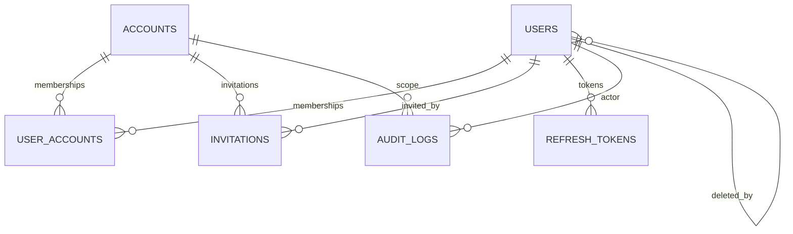

# ERD - Hono Boilerplate (D1/SQLite)

## Visao geral
Este documento descreve o modelo relacional atual utilizado no banco D1 (SQLite) do projeto. Ele foi derivado diretamente de `schema.sql`.

## Diagrama (Mermaid)

## Dicionario de dados

### users
- id: TEXT, PK, UUID
- google_id: TEXT, unique, not null
- email: TEXT, not null
- name: TEXT, not null
- avatar_url: TEXT, null
- status: TEXT enum('active','inactive'), default 'active', not null
- provider_ids: TEXT (JSON array), default []
- is_super_admin: INTEGER boolean, default 0, not null
- created_at: TEXT (datetime), default datetime('now'), not null
- updated_at: TEXT (datetime), default datetime('now'), not null
- deleted_at: TEXT (datetime), null
- created_by_id: TEXT, FK -> users.id, null
- updated_by_id: TEXT, FK -> users.id, null
- deleted_by_id: TEXT, FK -> users.id, null

### accounts
- id: TEXT, PK, UUID
- name: TEXT, not null
- description: TEXT, null
- domain: TEXT, unique, null
- created_at: TEXT (datetime), default datetime('now'), not null
- updated_at: TEXT (datetime), default datetime('now'), not null
- deleted_at: TEXT (datetime), null

### user_accounts
- user_id: TEXT, FK -> users.id, not null (on delete cascade)
- account_id: TEXT, FK -> accounts.id, not null (on delete cascade)
- role: TEXT enum('ADMIN','MANAGER','EDITOR','AUTHOR','VIEWER','BILLING','ANALYTICS'), not null
- PK composta: (user_id, account_id)

### refresh_tokens
- id: TEXT, PK, UUID
- user_id: TEXT, FK -> users.id, not null (on delete cascade)
- token_hash: TEXT, not null
- expires_at: INTEGER (timestamp)
- created_at: INTEGER (timestamp), default unixepoch()
- revoked_at: INTEGER (timestamp), null

### invitations
- id: TEXT, PK, UUID
- account_id: TEXT, FK -> accounts.id, not null (on delete cascade)
- email: TEXT, not null
- role: TEXT enum('ADMIN','MANAGER','EDITOR','AUTHOR','VIEWER','BILLING','ANALYTICS'), not null
- token: TEXT, unique, not null
- invited_by_id: TEXT, FK -> users.id, not null
- expires_at: TEXT (datetime), not null
- accepted_at: TEXT (datetime), null
- created_at: TEXT (datetime), default datetime('now'), not null
- unique index: (account_id, email)

### audit_logs
- id: TEXT, PK, UUID
- transaction_id: TEXT, not null
- account_id: TEXT, FK -> accounts.id, null
- user_id: TEXT, FK -> users.id, null
- entity: TEXT, not null
- entity_id: TEXT, not null
- action: TEXT enum('INSERT','UPDATE','DELETE','LOGIN','LOGOUT','SIGNUP','TOKEN_REFRESH','LOGIN_FAILED'), not null
- changes: TEXT (JSON), null
- ip_address: TEXT, null
- user_agent: TEXT, null
- timestamp: TEXT (datetime), default datetime('now'), not null

## Notas
- Campos de data/hora usam TEXT (ISO/datetime) na maioria das tabelas; `refresh_tokens` usa INTEGER (unix epoch).
- `users.email` nao possui unique constraint no schema atual.
- `audit_logs.account_id` e `audit_logs.user_id` podem ser nulos para eventos globais (ex.: login falho).
- Soft delete e suportado em `users` e `accounts` via `deleted_at`.
